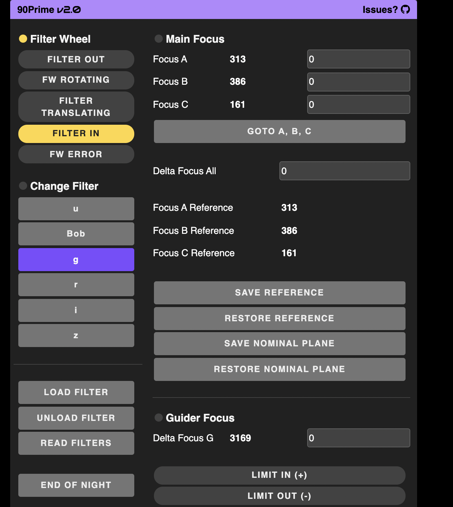

# pyINDI
Pure Python 3.7+ implementation of INDI for client and server

[](http://www.astropy.org)

# Instrument Neutral Distributed Interface (INDI) Overview
Example of a custom GUI using pyINDI


At it's core, INDI is a small set of xml definitions that are designed to be passed between a set of devices and clients.  Those definitions are described in detail by INDI's create Elwood Downey in the [INDI White Paper](http://www.clearskyinstitute.com/INDI/INDI.pdf). You can also find the DTD file in this repo [here](./pyindi/data). The passing of the XML between the device drivers and clients is almost always done by a server called indiserver


[indilib](https://indilib.org) is a c++ implementation of the INDI protocol with support for other languages (including python) via swig. It has a massive following in the astronomy community with lots of clients and devices/drivers. 

This repository aims to be a pure python implementation of the INDI protocol. It uses the indilib naming scheme for many of its methods and variable. 


# Install

```
pip install -r requirements.txt
python setup.py install
```

# Device Drivers

Device drivers are usually run as an argument to the indiserver program. Ubuntu users can get the indiserver program by adding the indilib ppa and installing indi bin

```bash
sudo apt-add-repository ppa:mutlaqja/ppa
sudo apt-get update

sudo apt install indi-bin
```

```
indiserver <path to executable device driver>
```

To learn how to build a device driver with this repo, look in [example_drivers](example_drivers/) directory. The [skeleton.py](example_drivers/skeleton.py) shows how to build a device driver from a skeleton xml file. To run this driver with indiserver type:


```
cd example_drivers

# the -vv argument gives you verbose output
indiserver -vv ./skeleton.py
```

This will start the indiserver with the skeleton driver running on port 7624. You can see all the output from indiserver by using netcat:

```
echo "<getProperties version='1.7'>" | nc localhost 7624
```

This should print the INDI xml. 


# Client

The best way to get started with a client is to use the [gui.py example](example_clients/gui/gui.py). You will have to change the indihost and indiport parameters to match your indiserver host and port. I recommend testing on one of the many indilib simulators. You can install the indiserver and the simulator driver on debian like systems with:

```
apt install indi-bin
```

To run the telescope simulator in indiserver type:
```
indiserver indi_simulator_telescope
```

Assuming you have installed pyindi, you should be able to run gui.py:

```
python3 gui.py
```

Assuming you are running this on localhost, you can then navigate to http://localhost:5905/ to take you to the gui.html webpage. You can change gui.html to build a custom gui or you can use the autogenerated pyindi-panel at http://localhost:5905/indi .


    


