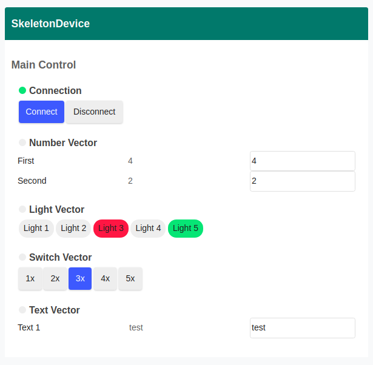

# pyINDI
Pure Python 3.7+ implementation of INDI for client and server

[](http://www.astropy.org)

# Instrument Neutral Distributed Interface (INDI) Overview
Example of a custom GUI using pyINDI


At it's core, INDI is a small set of xml definitions that are designed to be passed between a set of devices and clients.  Those definitions are described in detail by INDI's create Elwood Downey in the [INDI White Paper](http://www.clearskyinstitute.com/INDI/INDI.pdf). You can also find the DTD file in this repo [here](./pyindi/data). The passing of the XML between the device drivers and clients is almost always done by a server called indiserver


[indilib](https://indilib.org) is a c++ implementation of the INDI protocol with support for other languages (including python) via swig. It has a massive following in the astronomy community with lots of clients and devices/drivers. 

This repository aims to be a pure python implementation of the INDI protocol. It uses the indilib naming scheme for many of its methods and variable. 


# Install

```
python setup.py install
```

# Device Drivers

Device drivers are usually run as an argument to the indiserver program. Ubuntu users can get the indiserver program by adding the indilib ppa and installing indi bin

```bash
sudo apt-add-repository ppa:mutlaqja/ppa
sudo apt-get update

sudo apt install indi-bin
```

```
indiserver <path to executable device driver>
```

To learn how to build a device driver with this repo, look in [example_drivers](example_drivers/) directory. The [skeleton.py](example_drivers/skeleton.py) shows how to build a device driver from a skeleton xml file. To run this driver with indiserver type:


```
cd example_drivers

# the -vv argument gives you verbose output
indiserver -vv ./skeleton.py
```

This will start the indiserver with the skeleton driver running on port 7624. You can see all the output from indiserver by using netcat:

```
echo "<getProperties version='1.7'>" | nc localhost 7624
```

This should print the INDI xml. 


# Client

The best way to get started with a client is to use the [SkeletonClient.py example](example_clients/SkeletonClient.py). This is made to match [skeleton.py](example_drivers/skeleton.py) driver but should also work with other device drivers. 

To run this client:

```
cd example_clients/
python SkeletonClient.py
```

This will run the webserver and client.

The root url is serving the [client.html page](example_clients/client.html). 

## client.html

client.html is a good example of how to interact with the device driver with the [maps-indi](pyindi/www/static/maps-indi.js) api. This api gives you access to three functions. 

1. setPropertyCallback
This function maps a callback to an incoming indi vector property when it is recieved from the indiserver/device driver. This can either be a property definition (def) or an update (set). 

2. setINDI
This function sends an updated INDI vector property to the server/device driver from your webpage. 

3. showMapMessage
This function is called when the indiserver/device driver sens an INDI message. client.html simply prints to console.log. A dialog box on the webpage would be a better use of this funciton. 

    


