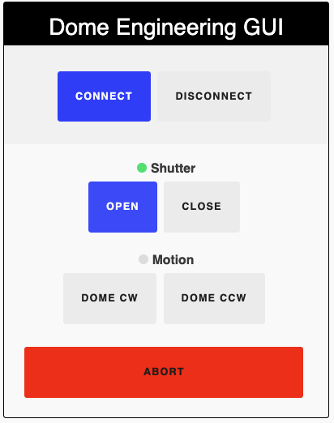

<div align="middle">


<br>

*pyINDI is a web-friendly python port of the widely adopted INDI protocol.*

[](http://www.astropy.org)
[]()
[](https://github.com/MMTObservatory/pyINDI/actions/workflows/jest.yml)

</div>

---

[View the SPIE poster](spie.jpg)

---

# Table of contents

- [Description](https://github.com/MMTObservatory/pyINDI#description)
  - [Instrument Neutral Distributed Interface (INDI) Overview](https://github.com/MMTObservatory/pyINDI#instrument-neutral-distributed-interface-indi-overview)
- [In Use At](https://github.com/MMTObservatory/pyINDI#in-use-at)
- [Requirements](https://github.com/MMTObservatory/pyINDI#requirements)
- [Installation](https://github.com/MMTObservatory/pyINDI#installation)
- [Drivers](https://github.com/MMTObservatory/pyINDI#drivers)
- [pyINDI Web Client](https://github.com/MMTObservatory/pyINDI#pyindi-web-client)
  - [Examples](https://github.com/MMTObservatory/pyINDI#examples)
    - [Using the default pyINDI GUI](https://github.com/MMTObservatory/pyINDI#using-the-default-pyindi-gui)
    - [Creating a custom GUI](https://github.com/MMTObservatory/pyINDI#creating-a-custom-gui)
- [License](https://github.com/MMTObservatory/pyINDI#license)

# Description

pyINDI includes tools for building a web-based client or driver and is compatible with any INDI compliant software. On the client side, a Javascript library communicates with the INDI  driver. The client side also includes HTML and CSS tools to auto generate a GUI based on the INDI properties.

<div align="middle">


</div>

### On the python backend
- Asynchronous network programming with asyncio
- Simplistic syntax and readability
- Access to the plethora of astronomy libraries and modules written in python astropy
- Easy integration with the C and C++ languages
- Web development tools ie tornado

### On the JavaScript frontend:
- No external libraries required
- Modern, responsive, and mobile-first design
- Rapidly develop custom GUIs by using data-attributes

## Instrument Neutral Distributed Interface (INDI) Overview

At it's core, INDI is a small set of xml definitions that are designed to be passed between a set of devices and clients.  Those definitions are described in detail by INDI's create Elwood Downey in the [INDI White Paper](http://www.clearskyinstitute.com/INDI/INDI.pdf). You can also find the DTD file in this repo [here](./pyindi/data). The passing of the XML between the device drivers and clients is almost always done by a server called indiserver


[indilib](https://indilib.org) is a c++ implementation of the INDI protocol with support for other languages (including python) via swig. It has a massive following in the astronomy community with lots of clients and devices/drivers.

This repository aims to be a pure python implementation of the INDI protocol. It uses the indilib naming scheme for many of its methods and variable.

# In Use At

<div align="middle">


</div>

**Steward Observatory**
- 61" Kuiper Telescope
  - [Mirror cover pyINDI driver code](https://github.com/so-mops/python-indidrivers/tree/main/indi-big61-mirrorcover)
  - [Dome shutter + windscreen pyINDI driver code](https://github.com/so-mops/python-indidrivers/tree/main/indi-big61-upperdome)
  - [Boltwood Cloud Sensor + weather station pyINDI driver code](https://github.com/so-mops/python-indidrivers/tree/main/indi-big61-weather)
- 90" Bok Telescope
  - [Flatfield lamps pyINDI driver code](https://github.com/so-mops/python-indidrivers/tree/main/indi-bok90-flatfield)
  - [90Prime custom pyINDI web client GUI](https://github.com/so-90prime/bok-90prime-gui)

**MMT Observatory**
  - Hectochelle/Hectospec
    - [pyINDI web client interface to wavefront sensors](https://github.com/MMTObservatory/camsrv/)
    - pyINDI web client interface to stages in f/5 topbox
  - Blue Channel
    - [pyINDI web client interface to wavefront sensors](https://github.com/MMTObservatory/camsrv/)
  - MMTCAM
    - pyINDI driver and client for apogee science camera (in development)


# Requirements

Python 3.7+

Built with
- [Tornado](https://www.tornadoweb.org/en/stable/) for websocket and backend

# Installation

```console
$ pip install git+https://github.com/MMTObservatory/pyINDI.git
```

# Drivers

Device drivers are usually run as an argument to the indiserver program.

- Ubuntu users can get the indiserver program by adding the indilib ppa and installing indi bin:

```console
$ sudo apt-add-repository ppa:mutlaqja/ppa
$ sudo apt-get update
$ sudo apt install indi-bin
```

- To run `indiserver` with a driver:

```console
$ indiserver <path to executable device driver>
```

To learn how to build a device driver with this repo, look in [example_drivers](example_drivers/) directory. The [skeleton.py](example_drivers/skeleton.py) shows how to build a device driver from a skeleton xml file.

- To run this driver with indiserver type:

```console
$ cd example_drivers
$ indiserver -vv ./skeleton.py
```

This will start the indiserver with the skeleton driver running on port 7624.

- You can see all the output from indiserver by using netcat:

```console
$ echo "<getProperties version='1.7'>" | nc localhost 7624
```

This should print the INDI xml.

# pyINDI Web Client

*Example of the default pyINDI light/dark mode GUI*

<div align="middle">


</div>

The pyINDI Web Client is written in vanilla JavaScript, has custom CSS and does not require any external libraries to run. XML is read in over the websocket, parsed client-side, and flattened into an object. This object is then passed through a handler that either builds or updates the client.

The design was developed with "mobile-first" in mind, allowing the client to be resized, viewed and used on any device. By communicating to the client over a websocket, any state changes are broadcasted to all users.

The power of the pylNDI client is the ability to rapidly develop and deploy custom GUls. This is accomplished by providing a `<div>` html element with two data-attributes, `data-custom-device` and `data-custom-vector` and by setting a flag on initialization. pyINDI will then know to build the property and attach to that `<div>` html element.

By supplying a little CSS and/or JavaScript, a custom GUI can be built with a personalized look and feel, added tips and hints, different labels, and/or new event listeners.

*Example of a custom GUI in use at Steward Observatory's 90" Bok Telescope* [View code](https://github.com/so-90prime/bok-90prime-gui)

<div align="middle">


</div>

## Examples

### Using the default pyINDI GUI

- Create a file `app.py` with:

```python
from pyindi.webclient import INDIWebApp

# The port for the web app
WEBPORT = 5905
# The indiserver port
INDIPORT = 7624
# Where the indiserver is running
INDIHOST = "localhost"
# All devices are called by an asterisk
DEVICES = ["*"]

web_app = INDIWebApp(webport=WEBPORT, indihost=INDIHOST, indiport=INDIPORT)

print(f"Go to http://<server_name>:{WEBPORT}")
print("If the server is on localhost go to:")
print(f"http://localhost:{WEBPORT}")

web_app.build_app()
```

- Start the `indiserver` and driver, we are using the included dome simulator:

```console
$ indiserver -vv indi_dome_simulator
```

- Run the pyINDI server with:

```console
$ python app.py

Go to http://<server_name>:5905
If the server is on localhost go to:
http://localhost:5905
```

- Navigate to <http://localhost:5905> to use the default pyINDI GUI

### Creating a custom GUI

- Create a file `gui.py` with:

```python
#!/usr/bin/python3.8
from pathlib import Path
# from tornado. import StaticFileHandler
from pyindi.webclient import INDIWebApp, INDIHandler

# Configuration
WEBPORT = 5905  # The port for the web app
INDIPORT = 7624  # The indiserver port
INDIHOST = "localhost"  # Where the indiserver is running
DEVICES = ["*"]  # All devices is called by an asterisk
CURRENT_DIR = Path.cwd()  # The current directory
TEMPLATE = "gui.html"


# Build handlers with path for rendering, each path should have a handler
class GUI(INDIHandler):
    def get(self):
        # Pass additional variables to appear in the html template
        self.indi_render(CURRENT_DIR / TEMPLATE, devices=DEVICES,
                         example_variable="Hello World", title="Test GUI")


web_app = INDIWebApp(webport=WEBPORT, indihost=INDIHOST, indiport=INDIPORT)
# If storing images, create image directory
# imgs = Path("/tmp/imgs")
# imgs.mkdir(exist_ok=True)

print(f"Go to http://<server_name>:{WEBPORT}")
print("If the server is on localhost go to:")
print(f"http://localhost:{WEBPORT}/")

# Attach handlers and build the application
# For images, use tornado.web.StaticFileHandler and link the path
web_app.build_app(
    [
        (r"/", GUI),
        # (r"/imgs/(.*)", StaticFileHandler, {"path": imgs})
    ],
)

```

- Create the html file `gui.html` with:

```javascript
<!doctype html>
<html lang="en">
  <head>
    
    <title>{{ title }}</title>
    <script>
      /**
      * Runs on load. Builds the default properties using a callback.
      */
      const main = () => {
        var devices = ;
        initialize(devices, customGui=true);
        return;
      }

      /**
      * This function will be called whenever an INDI property with the device
      *	{{ devices }} is received. This is where users should modify the
      *	code to append to specific objects.
      *
      * @param {Object} indi Contains all information about INDI property
      */
      const handleProperty = (indi) => {
        let htmlElement = handle(indi);

        // Bad selector, meaning the custom GUI selector not found
        // Want to check if not delProperty, message, or BLOB before issuing tip
        if (!htmlElement) {
          if (ApprovedOp.includes(indi.op) && indi.metainfo !== "bvp") {
            tag_str = `<div data-custom-vector="${indi.name}" data-custom-device="${indi.device}"/>`;
            console.debug(`Selector not found. To add vector to page use ${tag_str}`);
          }
          return;
        }

        if (indi.op === IndiOp.DEFINITION) {
          // Only update once (on definition)
          // Use for adding tooltips or modifying the look once
        }
        else if (indi.op === IndiOp.SET) {
          // Update everytime new values come in
          // Use for updating labels with values
        }
        else {
          console.warn(`Indi definition: ${indi.op} not found`)
        }

        return;
      }
    </script>
  </head>
  <body>
    <p>{{ example_variable }}</p>
    <!-- Insert elements to use for custom GUI -->
    <div data-custom-device="DEVICE NAME" data-custom-vector="VECTOR NAME"></div>
  </body>
  <script>document.body.addEventListener("load", main());</script>
</html>
```

- Run the `indiserver` with (we are using the included dome driver):

```console
$indiserver -vv indi_dome_simulator
```

- Run the server with:

```console
$ python gui.py

Go to http://<server_name>:5905
If the server is on localhost go to:
http://localhost:5905
```

- Navigate to <http://localhost:5905> to view the custom GUI built
  - For now, you will only see "Hello, World!" displayed, we will expand on this custom GUI later
- Navigate to <http://localhost:5905/indi> to view the default GUI that comes with pyINDI
  - Notice that the route for the default pyINDI GUI changed from root to `/indi`

Now let's customize the GUI at `/` and make a dome shutter GUI with large buttons and simple interface. It isn't the prettiest but more as a basic example of overriding styles and picking what controls you would like to show.

- Modify `gui.html`

```javascript
<!doctype html>
<html lang="en">
  <head>
    
    <title>{{ title }}</title>
    <script>
      /**
      * Runs on load. Builds the default properties using a callback.
      */
      const main = () => {
        var devices = ;
        initialize(devices, customGui=true);
        return;
      }

      /**
      * This function will be called whenever an INDI property with the device
      *	{{ devices }} is received. This is where users should modify the
      *	code to append to specific objects.
      *
      * @param {Object} indi Contains all information about INDI property
      */
      const handleProperty = (indi) => {
        let htmlElement = handle(indi);

        // Bad selector, meaning the custom GUI selector not found
        // Want to check if not delProperty, message, or BLOB before issuing tip
        if (!htmlElement) {
          if (ApprovedOp.includes(indi.op) && indi.metainfo !== "bvp") {
            tag_str = `<div data-custom-vector="${indi.name}" data-custom-device="${indi.device}"/>`;
            console.debug(`Selector not found. To add vector to page use ${tag_str}`);
          }
          return;
        }

        if (indi.op === IndiOp.DEFINITION) {
          // Only update once (on definition)
          // Use for adding tooltips or modifying the look once
        }
        else if (indi.op === IndiOp.SET) {
          // Update everytime new values come in
          // Use for updating labels with values
        }
        else {
          console.warn(`Indi definition: ${indi.op} not found`)
        }

        return;
      }
    </script>
  </head>
  <body>
    <!-- Insert elements to use for custom GUI -->
    <div class="card">
      <div class="card-title">
        <p class="card-title-text">Dome Engineering GUI</p>
        <div data-custom-device="Dome Simulator" data-custom-vector="CONNECTION"></div>
      </div>
      <div class="card-body">
        <p>To view controls, connect to dome shutter.</p>
        <div data-custom-device="Dome Simulator" data-custom-vector="DOME_SHUTTER"></div>
        <div data-custom-device="Dome Simulator" data-custom-vector="DOME_MOTION"></div>
        <div data-custom-device="Dome Simulator" data-custom-vector="DOME_ABORT_MOTION"></div>
      </div>
    </div>

  </body>
  <script>document.body.addEventListener("load", main());</script>
  <style>
    #Dome_Simulator__CONNECTION legend {
      display: none;
    }
    .card {
      text-align: center;
      border: 1px black solid;
      width: 400px;
      border-radius: .25rem;
    }
    .pyindi-switch-label {
      padding: 1.5rem;
    }
    .pyindi-switch-label[for=Dome_Simulator__DOME_ABORT_MOTION__ABORT] {
      background-color: red;
      width: 300px;
    }
    .card-title-text {
      font-size: 2rem;
      font-weight: 400;
      padding-top: 0;
      color: white;
      background-color: black;
      margin-top: 0;
      padding-top: 1rem;
      padding-bottom: .5rem;
    }
    #Dome_Simulator__DOME_ABORT_MOTION legend {
      display: none;
    }
    .card-title {
      padding-top: 0;
      background-color: rgb(243, 243, 243);
      padding-bottom: .25rem;
    }

  </style>
</html>
```

- Navigate to <http://localhost:5905> and you will see this simple GUI

<div align="middle">




</div>

# License

MMTObservatory/pyINDI is licensed under the BSD 3-Clause "New" or "Revised" License
